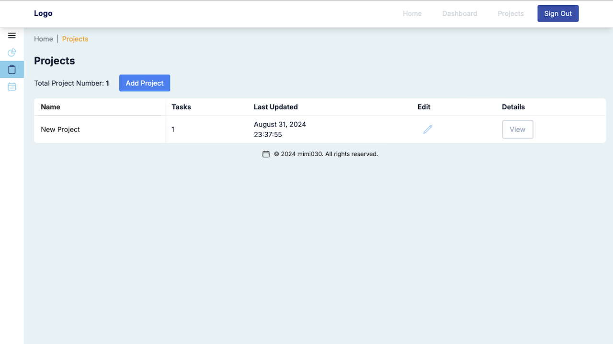
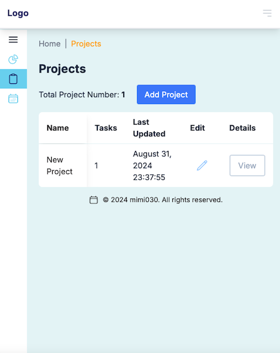
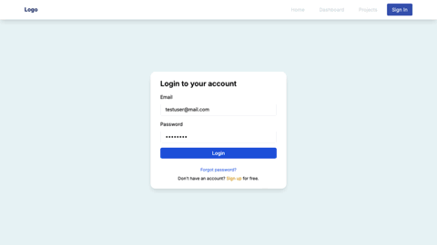
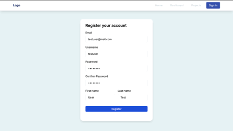

# Task Management System — Full Stack Project Management App

Desktop Preview            |  Mobile Preview
:-------------------------:|:-------------------------:
  |  

## Description
Task Management System is a full-stack project management application built with Django REST Framework and Next.js. It enables users to create and manage projects, organize tasks, add comments, assign tags, and track work efficiently through a clean and responsive interface.
The backend is powered by Django REST Framework with Djoser and Simple JWT for secure authentication and user management, while the frontend is built with Next.js to deliver a fast and seamless user experience.

<details>
  <summary>Project Walkthrough</summary>
  
</details>

<details>
  <summary>Auth Walkthrough</summary>
  
</details>

## Table of Contents
- [Features](#features)
- [Technologies Used](#technologies-used)
- [Installation Instructions](#installation-instructions)
- [Usage](#usage)
- [API Documentation](#api-documentation)
- [Planned Features](#planned-features)
- [Contributing](#contributing)
- [License](#license)
- [Acknowledgments](#acknowledgments)

## Features

- **User Authentication and Authorization**
  - Includes registration, account activation, login, and logout.
  - Password reset functionality with JWT tokens.

- **Token Cookies**
  - Stores user login tokens in cookies for a set duration.
  - Automatically handles token expiration and blocks timed-out tokens.

- **Project and Task Management**
  - **Project Visibility:** Only project owners and members assigned to a project can view the corresponding project and its tasks.
  - Create and manage projects, tasks, comments, and tags.
  - Project owner can assign members to projects and allocate tasks.
  - Edit project and task details, including status updates.
  - Users can leave comments on tasks to facilitate collaboration.

- **Navigation**
  - **Sidebar:** Provides easy access to various sections of the app with a responsive design that adjusts based on user interaction.
  - **Breadcrumb:** Shows the current page’s location within the app hierarchy, helping users navigate back to previous pages or higher levels in the hierarchy.

- **Responsive Design**
  - Optimized for both mobile and desktop viewing experiences.

- **Security**
   - **Content Security Policy (CSP) Settings:** 
     - To protect against XSS attacks, ensure you configure the CSP in your application.
     - Adjust these settings on backend (task_management_system) and frontend based on your application’s requirements.

## Technologies Used
- **Frontend**: React, Next.js, TypeScript, Tailwind CSS
- **Backend**: Django, Django REST Framework
- **Database**: SQLite
- **Authentication**: Djoser, JWT (JSON Web Tokens)
- **Data Fetching and Management**: Djoser, JWT (JSON Web Tokens)
  - **Axios:** Used for making HTTP requests from the frontend to the backend.  
  - **useSWR:** A React Hook library for data fetching and caching.
  - **Fetcher:** A utility function used with useSWR to handle API requests.

## Installation Instructions

### Prerequisites
- Python 3.11.x (for Django backend)
- Django 5.0.x (with Django REST framework)
- Next.js 14.x (for the frontend)
- Node.js v18.17.x and npm/yarn (for managing Next.js dependencies)
- SQLite or any supported database (for Django database)

### Backend Setup
1. Clone the repository:
   ```bash
   git clone https://github.com/mimi030/task_management_system_django_next_v1.git
   cd task_management_system_django_next_v1/task_management_system
   ```

2. Create a virtual environment and install dependencies:
   ```bash
   python3.11 -m venv venv
   source venv/bin/activate  # On Windows use `venv\Scripts\activate`
   pip install -r requirements.txt
   ```

3. Set up environment variables:
   Create a `.env` file in the backend directory and add the required environment variables (e.g., `DATABASE_URL`, `SECRET_KEY`).

4. Run database migrations:
   ```bash
   python manage.py makemigrations
   python manage.py migrate
   ```

5. Create superuser:
   ```bash
   python manage.py createsuperuser
   ```

6. Start the backend server:
   ```bash
   python manage.py runserver
   ```

### Frontend Setup
1. Navigate to the frontend directory:
   ```bash
   cd ../frontend
   ```

2. Install dependencies:
   If you are using npm
   ```bash
   npm install
   ```

   Or if you are using yarn
   ```bash
   yarn install
   ```

3. Set up environment variables:
   Create a `.env` file in the frontend directory and add the required environment variables (e.g., `NEXT_PUBLIC_API_BASE_URL`).

4. Start the frontend server:
   If you are using npm
   ```bash
   npm run dev
   ```

   Or if you are using yarn
   ```bash
   yarn dev
   ```

5. Build the project for production:
   To create an optimized production build, use:

   If you are using npm
   ```bash
   npm run build
   ```

   Or if you are using yarn
   ```bash
   yarn build
   ```

6. Start the production server:
   To run the production build, use:

   If you are using npm
   ```bash
   npm start
   ```

   Or if you are using yarn
   ```bash
   yarn start
   ```

## Usage
- Open your browser and navigate to `http://localhost:3000` to access the application.
- Use the provided authentication routes to log in or sign up..

## License
This project is licensed under the MIT License - see the [LICENSE](LICENSE) file for details.
